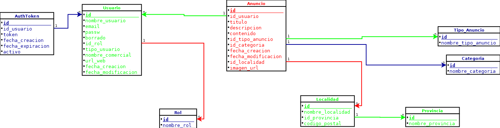

# FASE DE DESEÑO

- [FASE DE DESEÑO](#fase-de-deseño)
  - [1- Diagrama da arquitectura](#1--diagrama-da-arquitectura)
  - [2- Casos de uso](#2--casos-de-uso)
  - [3- Diagrama de Base de Datos](#3--diagrama-de-base-de-datos)
  - [4- Deseño de interface de usuarios](#4--deseño-de-interface-de-usuarios)

> *EXPLICACIÓN:* Este documento inclúe os diferentes diagramas, esquemas e deseños que axuden a describir mellor o [nome do proxecto] detallando os seus compoñentes, funcionalidades, bases de datos e interface.

## 1- Diagrama da arquitectura

## 2- Casos de uso

## 3- Diagrama de Base de Datos

 - Modelo Entidade/relación

 - Modelo relacional

## 4- Deseño de interface de usuarios

Prototipo en FIGMA https://www.figma.com/design/y4H8Sfw6a6Vo7keHFK3eq8/ElTablonDigital?node-id=0-1&t=nioOfL72xUUqnobS-1

[**<-Anterior**](../README.md)
