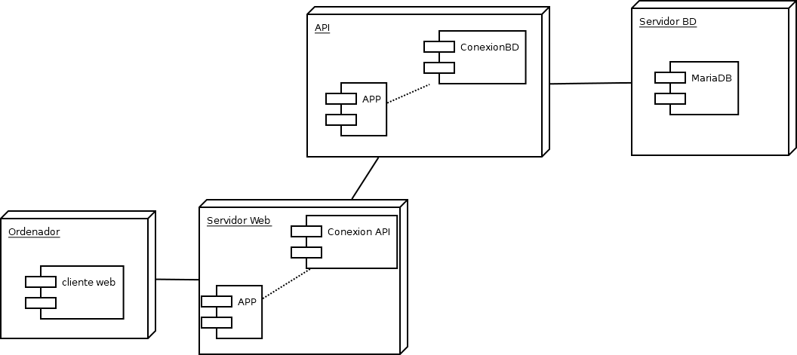

# FASE DE IMPLANTACIÓN

- [FASE DE IMPLANTACIÓN](#fase-de-implantación)
  - [1- Manual técnico](#1--manual-técnico)
    - [1.1- Instalación](#11--instalación)
    - [1.2- Administración do sistema](#12--administración-do-sistema)
  - [2- Manual de usuario](#2--manual-de-usuario)
  - [3- Melloras futuras](#3--melloras-futuras)

## 1- Manual técnico

### 1.1- Instalación

- Host:

 - Requirimentos de hardware.
    - Almacenamento: de 500 GB.
    - Memoria Ram: mínimo 8 GB.
    - CPU: mínimo 4 núcleos.

 - Software necesario: servidores (Exemplo servidor Web), software externo co que interaciona a nosa aplicación, contenedores, etc.

  SO:
  - Devian GNU/Linux 12 (bookworm)

  Utiliza Docker:
    -Docker v20.10.24 ou superior
    -Docker Copose v1.29.2 

  
 - Carga inicial de datos na base de datos. Migración de datos xa existentes noutros formatos.

    Lanzar os contenedores /Proxecto-DAW/proyecto sudo docker-compose up, na carpeta proyecto
    Entrar en http://localhost:8000/, login en la BD 

    Usuario: root
    contraseña: bitnami

    Ejecutar el Sql que se encuentra en: proyecto/scriptsBD/incialbd.sql

 - Usuarios da aplicación.
    - Administrador: 
      - user: administrador 
      - passw : abc123.
    - Usuario particular:    
      - user: particular 
      - passw : abc123. 
    - Usuario Empresa:
     - user: empresa 
     - passw : abc123. 

  - Se non funciona o subida de imaxes por permisos ,a carpeta de /uploads e os contidos teñen que pertencer a o usuario que executa o php, no meu caso e daemon.

### 1.2- Administración do sistema

 - Copias de seguridade do sistema.

 - Copias de seguridade de ../proyecto/pagina/uploads carpeta das imaxes da aplicacion subidas polos usuarios
 - Recomendase facer copias regulares da carpeta para non perder datos importantes.
 - Recomendase utlizar un sistema de copias automatizado con rsync ou outro tipo de scripts
 - O resto da aplicacion pode recuperarse reconpilando os contenedores.

- Copias de seguridade da base de datos.

  - As copias de seguridade da BD son imprescindibles para protexer os datos dos usuarios,
  - Recomendase exportar a base BD todos os dias a unha hora concreta.
  - Recomendase gardar nunca carpeta de exportacions que teña un sistema automatizado de backups

 - Xestión de usuarios.
    - Os usuarios xestionanse mediante na bd.
    - A creacion, modificacion, eliminacion e actualizacion realizanse na propia paxina ou por scripts dende a BD.
    - Dar rols concretos a usuarios, como administradores ou moderadores, so se poden otorgar directamente na BD.
    - As contraseñas na bd son hash cifrados con sha256.

 - Xestión seguridade.

  - A aplicación ten 2 niveis de seguridade, nivel aplicación e API
  - A bd so é accesible por a API.
  - API
    - A API e o unico punto de acceso a BD
    - Controla e valida as peticions.
    - As contraseñas se cifran antes de ser almacenadas.

  - A aplicación
    - Conecta coa API para todas as operacions.
    - Os usuarios deben estar autentificados ante o contido restrinxido.
    - A aplicacion xestiona sesións e roles.

## 2- Manual de usuario

- Manual de usuario:
  - Abrir el navegador e ir a direcion ip configurada
  - Zona publica.
    - Ver anuncios publicados e utilizar os filtros.

    - Facer click nun anuncio e ver maís información e ir a paxina do anuncio.
    - Na paxina de Anuncio facer click no nome de usuario e ir a paxina do usuario.

    - Rexistrarse como usuario novo, Click no boton de rexistro, selecionar o tipo de usuario no formulario, completar o formulario.
    - Autentificarse na paxina, Click no boton de iniciar sesión, completar o formulario cun usuario proporcionado.
      Exemplo:
       user: particular 
       passw : abc123. 

  - Zona privada. 

    - Pechar Sesión, Facer Click no boton de "Pechar sesión" o poweroff na barra de navegación.

    - Ver anuncios auto-Publicados, Click en tus Anuncios.
    - Publicar anuncio, Click en publicar anuncio o en "Tus Anuncio" facer click no elemento cun "+", vai a pestaña de publicar.
      Cubrir o formulario e darlle a "Guardar". O btn de "Volver" volve a paxina de "Tus Anuncios".

    - Editar Anuncio, Na pestaña de "Tus anuncios" Facer click en "Editar", ou na paxina dun anuncio creado por o usuario autentificado no btn das opcions "Modificar Anuncio". Cubrir o formulario e darlle a "Guardar".
    - Borrar Anuncio  Na pestaña de "Tus anuncios" Facer click en "Borrar", ou na paxina dun anuncio creado por o usuario autentificado no btn das opcions "Borrar Anuncio".

    - Editar informacion Usuario, Na pestaña de "Tu perfil " Facer click en "Modificar Usuario". Cubrir o formulario e darlle a "Guardar".
    - Cambiar contraseña, Na pestaña de "Tu perfil " Facer click en "Cambiar Contraseña. Cubrir o formulario e darlle a "Guardar". 
    - Eliminar Usuario, Na pestaña de "Tu perfil " Facer click en "Eliminar Usuario", borranse todos os anuncios asociados a ese usuario.

 FAQ ou outro xeito que sexa o máis adecuado para que os usuarios saiban usar a nosa aplicación informática.

 - FAQ
   1. Necesito rexistrarme para utilizar a páxina?
    - Non , é unha páxina que non require autentificarse para poder ver o contido.

   2. Que tipo de información podo atopar na páxina?
    - Todo tipo de anuncios, avisos e información de eventos.

   3. Preciso intalar algo para poder utilizar a páxina?
    - Non , é unha paxina completamente funcional no navegador Web.

   4. En que dispositivos funciona a páxina?
    - A páxina e acesible en todos os dispositivos, 
móbiles, tabletas e ordenadores.

   5. Que fago si perdo o contrasinal?
    - Contacta coa administración do sitio.
   
   6. Como podo reportar algun erro?
     - Contacta cun administrador ou moderador.
   
## 3- Melloras futuras

   - Sistema de estadisticas.
   - Sistemas de monetización e suscripcions, para creacion de auncios comerciais, e descontos coa subcripciós no momento de publicar anuncios.
   - Implementación de comentarios.
   - Sistema de moderacion de contidos.
   - Sistema de idioma, para cambiar o idioma da páxina.
   - Modo Noite.
   - Implementacion ,integracion é uso do sistema de informacion geografíca como google maps.
   - Integracións con Redes sociais.
   - Sistema de notificacións por correo.
   - Sistema de Mensaxería interno dentro da aplicación.
   - Utilizacion de google ads, para obter ganacias adicionais.

   - Desenvolvemento dunha aplicación móbil propia.

[**<-Anterior**](../README.md)
